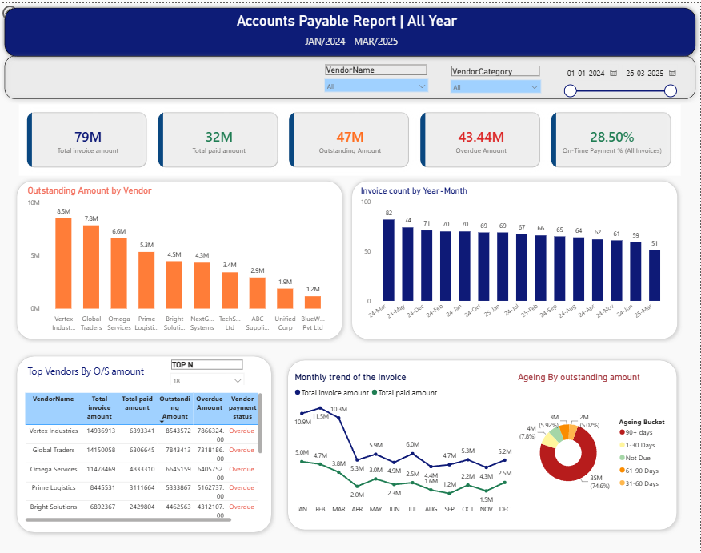

# 📊 Accounts Payable Dashboard | Power BI

## Project Overview

The Accounts Payable (AP) Dashboard provides a comprehensive view of invoice processing, vendor payments, outstanding liabilities, and aging analysis. It enables finance teams to monitor payment performance, identify overdue invoices, and optimize cash flow management.

**Reporting Period:** January 2024 – March 2025

---

## 🎯 Business Objective

The objective of this dashboard is to help Accounts Payable teams:

- Track total invoices and payments
- Monitor outstanding liabilities
- Identify overdue payments
- Analyze vendor-wise exposure
- Improve payment cycle efficiency
- Support financial decision-making through actionable insights

---

## 🛠 Tools & Technologies

- Power BI Desktop
- Power Query
- DAX
- Excel
- Data Modeling
- Data Visualization

---

## 📌 Key Performance Indicators (KPIs)

| KPI | Value |
|------|--------:|
| Total Invoice Amount | $79M |
| Total Paid Amount | $32M |
| Outstanding Amount | $47M |
| Overdue Amount | $43.44M |
| On-Time Payment % | 28.50% |

---

## 📈 Dashboard Features

### Executive Overview

Provides a high-level summary of Accounts Payable performance including:

- Total Invoice Amount
- Total Paid Amount
- Outstanding Amount
- Overdue Amount
- On-Time Payment Percentage

### Vendor Analysis

Analyze vendors based on:

- Outstanding balances
- Total invoices
- Total payments
- Overdue amounts
- Vendor payment status

### Invoice Trend Analysis

Track invoice volumes and payment trends over time.

### Aging Analysis

Monitor overdue invoices by aging buckets:

- 0–30 Days
- 31–60 Days
- 61–90 Days
- 90+ Days

---

## 📷 Dashboard Screenshot



---

# 🔍 Business Insights

## 1. High Outstanding Exposure

- Total outstanding amount stands at **$47M**.
- Outstanding liabilities account for approximately **59%** of total invoice value.
- Indicates significant unpaid obligations requiring immediate attention.

## 2. Overdue Invoices Are Critically High

- Overdue amount reached **$43.44M**.
- Nearly **92% of outstanding invoices are overdue**.
- This may impact vendor relationships and increase financial risk.

## 3. Low On-Time Payment Performance

- On-Time Payment Rate is only **28.5%**.
- More than 70% of invoices are being paid after their due date.
- Suggests opportunities to improve payment scheduling and AP processes.

## 4. Vendor Concentration Risk

Top vendors contribute the largest share of outstanding balances:

| Vendor | Outstanding Amount |
|---------|------------------:|
| Vertex Industries | $8.5M |
| Global Traders | $7.8M |
| Omega Services | $6.6M |
| Prime Logistics | $5.3M |

These vendors should be prioritized for payment planning and negotiations.

## 5. Majority of Outstanding Amount is Severely Overdue

Aging analysis indicates:

- Approximately **75% of outstanding balances fall into the 90+ Days bucket**.
- Long-overdue invoices represent the largest financial risk area.

### Recommended Actions

- Escalate aged invoices
- Conduct vendor reconciliation
- Implement automated payment reminders
- Review approval workflows

## 6. Invoice Volume Trend

Invoice counts remain relatively stable throughout the reporting period:

- Highest monthly invoice count: **82**
- Lowest monthly invoice count: **51**

This suggests that overdue balances are driven more by payment delays than invoice volume fluctuations.

## 7. Payment Performance Trend

Monthly trends show:

- Invoice amounts consistently exceed payment amounts.
- Payment activity has not kept pace with invoice generation.
- This has contributed to the accumulation of outstanding liabilities.

---

# 💡 Recommendations

### Immediate Actions

- Prioritize payment of 90+ day invoices
- Focus on top outstanding vendors
- Review payment approval bottlenecks
- Strengthen invoice validation processes
- Implement vendor payment alerts
- Monitor AP KPIs monthly

---

## 📂 Repository Structure

```text
Accounts-Payable-Dashboard-PowerBI/
│
├── README.md
├── pbix/
│   └── AP_Dashboard.pbix
│
├── screenshots/
│   └── AP_Dashboard.png
│
├── data/
│   └── AP_Data.xlsx
│
├── dax-measures/
│   └── DAX_Measures.md
│
└── documentation/
    └── Project_Documentation.pdf
```

---

## 🚀 Skills Demonstrated

- Data Modeling
- Data Cleaning
- Power Query Transformations
- DAX Calculations
- Financial Analytics
- Accounts Payable Reporting
- KPI Development
- Dashboard Design
- Business Insight Generation
- Stakeholder Reporting

---

## 📈 Business Value

This dashboard helps finance teams:

- Improve payment efficiency
- Reduce overdue liabilities
- Monitor vendor relationships
- Optimize working capital
- Enhance financial visibility
- Support data-driven decision making

---

## 👤 Author

**Bhavani B R**

Power BI Developer | Data Analyst

- GitHub: https://github.com/BhavaniAshik
- LinkedIn: https://www.linkedin.com/in/bhavani-b-r-/
